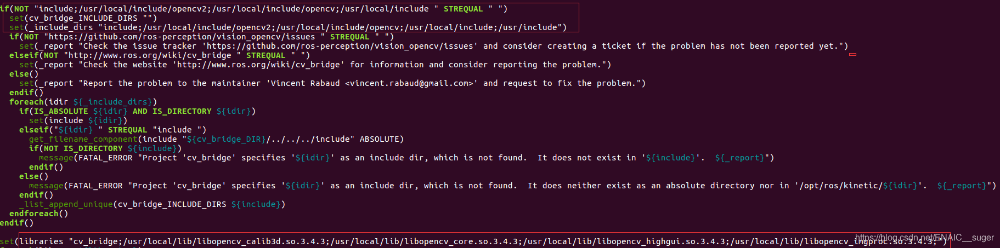

# ros 解决opencv版本冲突

ubuntu配置opencv3.4.X配置好后，按我的路径而言在如下链接中

```py
/usr/local/include
/usr/local/lib
```

可以在如下路径找到ros的cv配置文件

```
cd /opt/ros/kinetic/share/cv_bridge/cmake/
sudo gedit cv_bridgeConfig.cmake
```

将cv_bridgeConfig.cmake文件中94行后如图配置

